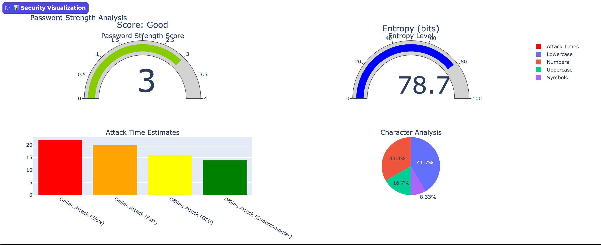

# 🔑 Password Strength Visualizer + Explainer

An interactive password strength analyzer that visualizes security metrics, estimates attack times, and provides AI-powered explanations to help users create stronger passwords.

---

## 🚀 Overview

The **Password Strength Visualizer** is a comprehensive security tool that analyzes password strength using multiple methodologies including entropy calculation, attack time estimation, and dictionary vulnerability checks. It provides real-time visual feedback and AI-powered explanations to help users understand and improve their password security.

---

## 🚀 Live Demos

[

## 🔑 Password Checker Demo

*Password Strength Visualizer analyzing password security with real-time feedback and AI explanations*

---

## ✨ Features

- 🔢 **Entropy Calculation:** Measures password unpredictability using information theory
- ⏱️ **Attack Time Estimation:** Shows cracking time across different attack scenarios (online, offline, GPU, supercomputer)
- 📚 **Dictionary Attack Simulation:** Checks against common password databases
- 📊 **Interactive Visualizations:** Real-time charts, gauges, and progress indicators
- 🤖 **AI-Powered Explanations:** Natural language feedback explaining password strengths/weaknesses
- 🎯 **Real-time Analysis:** Instant feedback as you type
- 📱 **Responsive Design:** Works on desktop and mobile devices

---

## 🛠️ Technologies Used

| Component                | Technology/Library          |
|--------------------------|----------------------------|
| Password Analysis        | Python, zxcvbn             |
| Entropy & Attack Models  | math, information theory   |
| AI Explanations          | transformers, DialoGPT     |
| Visualization            | Plotly, Matplotlib, Seaborn|
| Web Interface            | Gradio                     |
| Data Processing          | pandas, numpy              |

---

---

## 🎯 Usage

### Option 1: Try the Live Demo
**[🚀 Try Live Demo on Hugging Face](https://huggingface.co/spaces/yourusername/password-strength-visualizer)**  
*No installation required - analyze passwords instantly!*

### Option 2: Run the Notebook
**[📓 Try the Google Colab Notebook](https://colab.research.google.com/drive/your-notebook-link)**  
*Interactive step-by-step implementation with explanations*

### Option 3: Local Installation
1. **Launch the app** - Open your browser to the provided local URL
2. **Enter a password** in the input field
3. **Click "Analyze Password"** to get instant feedback
4. **Review the results:**
- Password strength score (0-4)
- Entropy measurement in bits
- Estimated crack times for different attack types
- AI-powered explanation of strengths/weaknesses
- Visual charts and indicators

---

